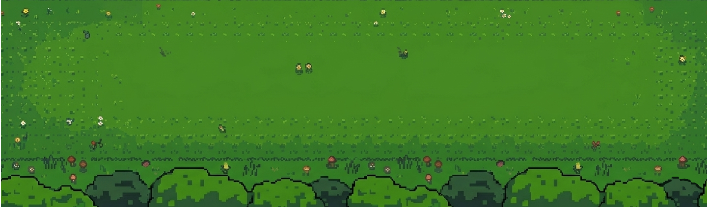

# 🐱🍪 Cats'N Cookies RUN!

## 1. Identificação do Projeto

**Título do Projeto:**
Cats'N Cookies RUN!

** Desenvolvedor:**  
João Pedro Keidann

** Logotipo / Banner:**  


---

## 2. Visão Geral do Sistema

###  Descrição
Cats'N Cookies RUN! é um jogo 2D desenvolvido em JavaScript utilizando canvas, onde dois personagens jogáveis enfrentam inimigos enquanto avançam por fases progressivas.

---

###  Objetivo
O objetivo do jogo é derrotar inimigos, acumular pontos e avançar por fases até alcançar o chefe final.

---

###  Tema
O jogo conta a história de um **gato chamado Guto** e um **pato chamado Renato**, que partem em uma jornada para recuperar a **Bolacha Lendária**, roubada pelo misterioso **Renato Reverso**.

Essa bolacha possui poderes extraordinários, concedendo **dádivas inimagináveis** a quem a possui completa.

---

###  Instruções de Jogabilidade

####  Jogador 1 (Guto - ataque à distância)
- **W A S D** → Movimentação  
- **Espaço** → Atirar

####  Jogador 2 (Renato - ataque corpo a corpo)
- **Setas (↑ ↓ ← →)** → Movimentação  
- **Enter** → Ataque com espada

---

### Mecânicas do Jogo

-  **Sistema de Fases**
  - O jogo possui múltiplas fases com dificuldade crescente
  - A progressão ocorre ao atingir certa quantidade de pontos

-  **Sistema de Vidas**
  - Cada jogador possui 3 vidas
  - Ao colidir com inimigos, perde vida

-  **Pontuação**
  - Derrotar inimigos concede pontos
  - Pontos são usados para avançar de fase

-  **Tipos de Ataque**
  - Guto: ataque à distância (tiros)
  - Renato: ataque corpo a corpo (espada)

-  **Background Dinâmico**
  - Cada fase possui cenários diferentes
  - Sistema de parallax para profundidade visual

- **Coletáveis de Vida**
  - Corações aparecem durante as fases
  - Ao coletar um coração, o jogador ganha **+1 de vida**
  - Não ultrapassa o limite máximo de vidas

- ☠️ **Game Over**
  - O jogo termina quando todos os jogadores perdem suas vidas

---

###  Créditos

- **Desenvolvedor:** João Pedro Keidann  
- **Product Owner (Professor):** Carlos Roberto Da Silva Filho  
- **Versão:** v1.0.0 — 2026  

---

###  Link de Produção

https://catsncookiesrun.vercel.app

---

## 3. Instruções de Instalação e Execução

###  1. Clonar o repositório
```bash
git clone https://github.com/jpkeidann/jogo_carro_3b.git
```

---

###  2. Instalar dependências
*(Este projeto não utiliza dependências externas via npm)*

---

### ▶ 3. Executar o projeto

Você pode rodar o jogo de duas formas:

#### Opção 1: Abrir direto
- Abra o arquivo `index.html` no navegador

####  Opção 2: Servidor local (recomendado)
Use uma extensão como Live Server no VSCode.

---

## Considerações Finais

Cats'N Cookies RUN! foi desenvolvido com foco em:
- Aprendizado de lógica de jogos
- Manipulação de canvas
- Estruturação de código orientado a objetos

---

 **Prepare-se para recuperar a Bolacha Lendária!**
